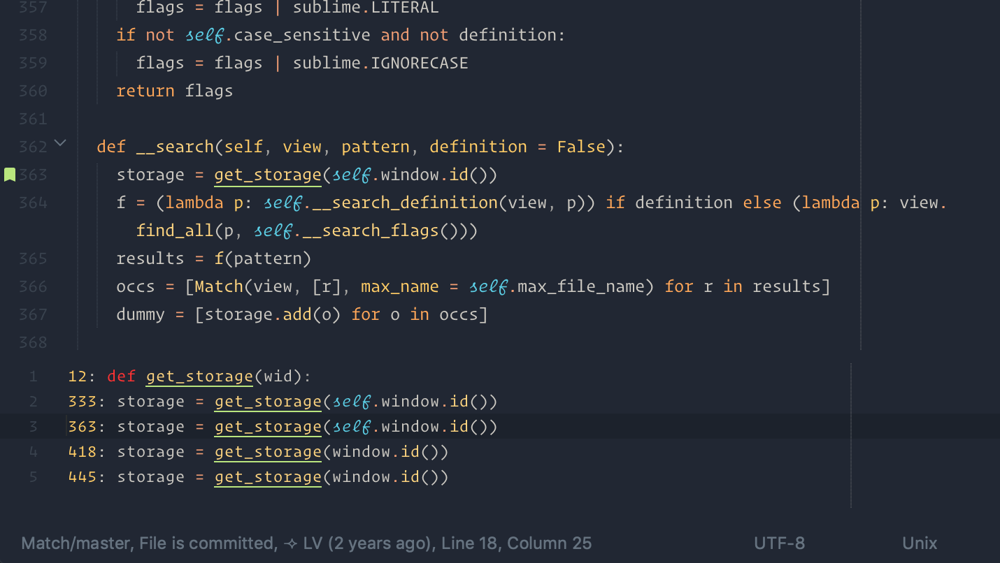

# Match

Find all matches of a given pattern in a given view(s) in Sublime Text, similar to Emacs' `occur-mode`.

This package is inspired by Emacs' `occur-mode` and [Sean Gilbertson's](https://github.com/dreki/sublime-occur) port to Sublime Text.

# Install

The package can be installed using one of the following methods:

## Via [Package Control](https://packagecontrol.io) (recommended)

`Package Control: Install Package > Match`

## Manual

1. `Sublime Menu > Preferences > Browse Packages ...`
2. `git clone https://github.com/li-vu/st-match match`

# Usage

- Use one of the following to trigger the search for matches:
    1. Find matches of the current word under the cursor by pressing `F8`, or
    2. Bring up an input panel by the command `Match: Find ...`

- Once the search finishes, an output panel will list the matches and their line numbers.

- Use `up` and `down` to move between the matches in the output panel. As an match is selected, the view will move to its location, and the match will be underlined in the view.

- Use `enter` or double-click to move to a given match.

# Options

- `match_use_regex`: use regular expression, (default: `false`).
- `match_case_sensitive`: case sensitive (default: `false`).
- `match_search_in_all_open_files`: search in all open files (default: `false`, i.e. search in only the active view),
- `match_embedded_syntax`: embedded the active view syntax highlight into the Match's output panel (default: `true`). This only works when running in the active view.
- `match_file_name_shortening_threshold`: when searching all open files, shorten file names that are longer than the threshold (default: 32 characters).

# License
